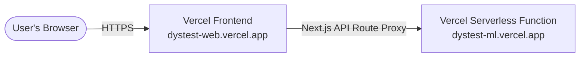

# DysTest — Gamified Dyslexia Screening Platform

**DysTest** is a standalone, interactive dyslexia screening web application. Children aged 7–17 complete a series of 33 gamified cognitive tasks while the system silently collects behavioral metrics. A suite of age-specific machine learning models then estimates dyslexia risk instantly.

> **No webcam. No eye tracker. No special hardware. Just play.**

---

## Modern Consolidated Flow

DysTest features a highly streamlined, modern card flow tailored for children, parents, and researchers. The entire interface is structured as self-contained cards optimized above-the-fold, requiring **zero scrolling** for a pristine, distraction-free screening experience:
1. **Details Card (`/`)** — A sleek glassmorphic overview showcasing targeted cognitive metrics.
2. **Guidelines Card (`/instructions`)** — Important environment setup tips, sound checks, and parent supervision guidelines.
3. **Demographics Form (`/gamified-test`)** — Fast participant configuration form that automatically bootstraps a client-safe session.
4. **Active Screening (`/gamified-test/test/[sessionId]`)** — 33 cognitive games where audio instructions play automatically in the background. Features a circular progress timer that operates seamlessly on clicks.

---

## What Is DysTest?

DysTest was developed as a graduation research project at the Faculty of Computing and Data Science. It implements the **Dytective methodology** (Rello et al., 2020) — a scientifically validated, IRB-approved gamified dyslexia screening battery.

The system is built in two independent parts:

| Folder | Description |
|--------|-------------|
| `web/` | Next.js 15 frontend — dynamic gameplay UI (Clean Light & Gamified themes) |
| `ml-service/` | FastAPI backend — ML Random Forest inference service |
| `ml-work/` | Research notebooks, model training, and experiments |

---

## The Science Behind DysTest

### Cognitive Domains (33 Questions)

| Domain | Questions | Skills Tested |
|--------|-----------|---------------|
| Letter Recognition | Q1–Q13 | Identifying correct, mirrored, and different letters |
| Visual Discrimination | Q14–Q17 | Spotting the different letter in a group |
| Phonological Awareness | Q18–Q25 | Matching sounds, rhymes, and phoneme patterns |
| Grapheme Mapping | Q26–Q27 | Letter replacement and arrangement |
| Syllable Processing | Q28–Q29 | Arranging syllables to form words |
| Working Memory | Q30–Q32 | Typed sequence recall |
| Sequence Recall | Q33 | Memorization task |

### Machine Learning Models (V2)

Three **Random Forest** models cover three developmental age groups:

| Model | Ages | File |
|-------|------|------|
| G1 | 7–8 years | `model_G1_7_8_V2.pkl` |
| G2 | 9–11 years | `model_G2_9_11_V2.pkl` |
| G3 | 12–17 years | `model_G3_12_17_V2.pkl` |

Thresholds are determined via **Youden's J statistic** to maximize sensitivity + specificity for each age group.

### Feature Engineering (V2 Corrections)

1. **Clipping** — Raw `Accuracy*` and `Missrate*` values are clipped to `[0, 1]` to fix division-by-zero artifacts from the original Dytective data.
2. **Adjusted Accuracy** — For questions where click mechanics inflate raw accuracy (Q26–Q28, Q30–Q32), `AdjAcc = Hits / (Hits + Misses)` is computed at inference time.

---

## Quick Start

### Requirements
- Node.js 18+ (web)
- Python 3.12+ (ml-service)

### Run the Frontend

```bash
cd web
npm install
cp .env.example .env.local
npm run dev
```

Open [http://localhost:3000](http://localhost:3000).

### Run the ML Service

```bash
cd ml-service
python -m venv .venv && .venv/Scripts/activate
pip install -e ".[dev]"
cp .env.example .env
uvicorn app.api:app --reload --port 8001
```
### Docker (ML Service only)

```bash
cd ml-service
docker build -t dystest-ml-service .
docker run -p 8001:8001 dystest-ml-service
```

---

## 🚀 Deploying to Vercel

Both the Next.js frontend (`web/`) and the FastAPI backend (`ml-service/`) can be deployed directly to **Vercel** as two separate projects linked to your GitHub repository.



### 1. Deploy the FastAPI ML Service (`ml-service/`)

Vercel natively runs Python apps as Serverless Functions using the `@vercel/python` builder. We have pre-configured `ml-service/vercel.json` and `ml-service/api/index.py` for a zero-config setup.

1. Go to the [Vercel Dashboard](https://vercel.com/) and click **Add New** -> **Project**.
2. Import your `dyslexia-screening` GitHub repository.
3. In the project setup panel:
   * **Project Name**: E.g., `dystest-ml-service`
   * **Framework Preset**: Select **Other**.
   * **Root Directory**: Click *Edit* and select **`ml-service`**.
4. Click **Deploy**. Vercel will:
   * Detect the `vercel.json` config.
   * Auto-install all Python dependencies listed in the `requirements.txt` file (including `scikit-learn`, `numpy`, and `pandas`).
   * Deploy the service as a standard serverless function.
5. Once deployment is complete, copy the **Production URL** (e.g. `https://dystest-ml-service.vercel.app`).

### 2. Deploy the Next.js Web App (`web/`)

1. Go back to your Vercel Dashboard, click **Add New** -> **Project**.
2. Import your `dyslexia-screening` GitHub repository again.
3. In the project setup panel:
   * **Project Name**: E.g., `dystest-screening`
   * **Framework Preset**: **Next.js**
   * **Root Directory**: Click *Edit* and select **`web`**.
4. Open the **Environment Variables** accordion and add:
   * **Key**: `ML_SERVICE_URL`
   * **Value**: `https://dystest-ml-service.vercel.app` *(Replace with your actual FastAPI Production URL from Step 1)*
5. Click **Deploy**. Vercel will build the Next.js client-side assets and compile all server-side endpoints automatically!

---

## Disclaimer

DysTest is a **research screening tool** and does **not** provide a clinical diagnosis of dyslexia. Results are statistical risk estimates that must be interpreted by qualified educational psychologists or healthcare professionals.
